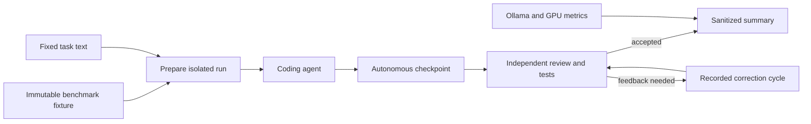

# Local Coding Agent Benchmark

Sanitized benchmark harness and recorded results for local coding agents on one NVIDIA A100 80 GB GPU. The study compares Qwen3.6-35B-A3B Q8 with gpt-oss-120b MXFP4, evaluates Qwen Code against OpenHands, and uses cloud Codex as a reference baseline.

The benchmark asks each candidate to solve the same three C# tasks from the same clean repository. It records autonomous quality, correction cycles, wall time, API latency, generation speed, peak VRAM, tool failures, and the final accepted result.

## Headline result

No single configuration won every dimension.

- Qwen3.6 Q8 with Qwen Code completed two tasks autonomously and needed four correction cycles on the concurrency task.
- gpt-oss-120b with Qwen Code completed two tasks autonomously and needed three correction cycles on the concurrency task. Its measured API path was faster and used more VRAM.
- gpt-oss-120b with OpenHands reached clean acceptance across all three tasks in 544 active seconds, compared with 1,519 seconds for Qwen Code on the same model. It also added unrelated installer artifacts and required technical setup work plus two functional corrections on the concurrency task.
- Cloud Codex served as a quality reference. Provider-side latency, throughput, context, and GPU metrics remain `N/A` rather than estimated.

The experiment selected **gpt-oss-120b with OpenHands** for the next stage. The model comparison favored gpt-oss over Qwen in the same Qwen Code shell; the shell comparison then favored OpenHands on active time. Hygiene failures, setup effort, and reasoning-control differences remain explicit engineering constraints rather than hidden costs.

See [results.csv](results.csv) for the compact public dataset and [results.md](docs/results.md) for interpretation.

## Experiment design

The experiment treats the model and agent runtime as independent axes:

- Models: Qwen3.6-35B-A3B Q8 and gpt-oss-120b MXFP4.
- Agent runtimes: Qwen Code and OpenHands.

Cloud Codex remains a reference baseline for task quality and workflow comparison.

The test matrix contains 12 primary runs:

| Phase | Model | Quantization | Agent shell | Tasks |
|---|---|---|---|---|
| Local model | Qwen3.6-35B-A3B | Q8_0 | Qwen Code | ERP-001, ERP-003, ERP-004 |
| Local model | gpt-oss-120b | MXFP4 | Qwen Code | ERP-001, ERP-003, ERP-004 |
| Shell comparison | gpt-oss-120b | MXFP4 | OpenHands 1.16 | ERP-001, ERP-003, ERP-004 |
| Reference | Provider-managed Codex | Provider-managed | Codex | ERP-001, ERP-003, ERP-004 |

Every run starts from an immutable fixture. The harness copies it into an isolated Git repository, inserts one task, records the baseline commit, and collects the resulting patch and test output. Feedback continues in the same run so the autonomous checkpoint stays available for review.



The full protocol lives in [experiments/benchmark-protocol.md](experiments/benchmark-protocol.md). The scoring rubric is in [experiments/scoring-guide.md](experiments/scoring-guide.md).

## Run the sanitized harness

Requirements:

- Ubuntu 24.04 or a comparable Linux host
- Docker Engine with Compose
- NVIDIA Container Toolkit and one supported GPU
- enough disk and VRAM for the selected model
- Qwen Code or OpenHands, depending on the matrix row

Copy the example configuration, review every value, then run the local checks:

```bash
cp .env.example .env
./scripts/check-local.sh
docker compose --profile tests run --rm demo-tests
```

Pull and verify one model profile:

```bash
./scripts/pull-model.sh qwen36-q8
./scripts/switch-model.sh qwen36-q8
./scripts/verify.sh
```

Create an isolated run and collect its evidence:

```bash
./scripts/prepare-run.sh qwen-q8-erp001-a1 qwen36-q8 qwen-code ERP-001 on
./scripts/timer.sh qwen-q8-erp001-a1 autonomous -- <agent command>
./scripts/checkpoint-run.sh qwen-q8-erp001-a1 autonomous
./scripts/finish-run.sh qwen-q8-erp001-a1
```

The command-line contract is documented inside each script. Model downloads, paid compute, and third-party agent installation are deliberate operator steps. The OpenHands image matches the recorded Agent Canvas 1.16.0 digest and bundles agent-server/SDK 1.44.0, but the public Compose wiring is a sanitized reconstruction of the runtime. Treat the harness as a reconstruction until the remaining verification items in the publication checklist are complete.

## Repository map

- `compose.yaml`: localhost-bound Ollama, OpenHands, PostgreSQL, and test services.
- `models/`: model and inference profiles used by the experiment.
- `agent-runtimes/qwen-code/`: Qwen Code configuration for running different local models.
- `agent-runtimes/openhands/`: OpenHands configuration notes; the runtime itself is defined in `compose.yaml`.
- `scripts/`: run isolation, timing, metrics, evidence capture, and summary generation.
- `experiments/`: fixed protocol, scoring rubric, matrix, and task prompts.
- `demo/guard-erp/`: synthetic C# fixture used for the recorded runs.
- `results.csv`: reduced dataset with no raw conversations, host logs, addresses, or local paths.
- `docs/`: results, limitations, security notes, provenance, and publication checklist.

## Security boundary

Services bind to localhost by default. OpenHands receives write access only to `.runs`, but its container controls a Docker socket. Treat the benchmark host as disposable and do not place production credentials or unrelated repositories on it.

Raw agent conversations, container inspection output, infrastructure logs, `.env`, host paths, addresses, and exported archives are excluded from this public copy. See [docs/security-and-sanitization.md](docs/security-and-sanitization.md).

## Publication status

The repository owner confirmed that the Guard ERP fixture was created for this benchmark and contains no client code or data. Original repository content is available under the [MIT License](LICENSE). Referenced third-party packages, images, tools, and models retain their own terms; see [THIRD_PARTY_NOTICES.md](THIRD_PARTY_NOTICES.md).

Publication checks and the remaining reproducibility work are recorded in [docs/publication-checklist.md](docs/publication-checklist.md).
